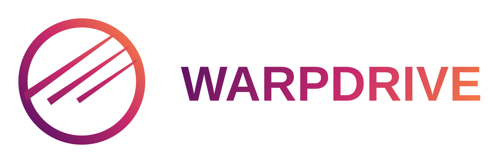

  

  
<strong>Object storage for systems and the agentic era</strong>

  

    
    
    
    
    
    
    
  

📄 **Position Paper (Vision):** [*WarpDrive: A Composable Storage Substrate for Disaggregated Data Systems*](https://vldb.org/2026/Workshops/VLDB-Workshops-2026/CDMS/CDMS26_8.pdf), accepted as a **lightning talk at CMDS (Composable Data Management Systems), the VLDB 2026 workshop**.

---

## About

WarpDrive is a purpose-built KV/Object store focused on workloads that demand high throughput. Practical applications driving our development are storage-disaggregated architectures and data-intensive distributed systems.
Our broader aim is to build storage primitives and interfaces with a deep understanding of the underlying backend architecture, making computational pushdown and storage-centric execution first-class capabilities. By exposing these abstractions cleanly, we aim to simplify how data systems, ML frameworks, and agentic workflows move computation closer to data, reducing unnecessary data movement while enabling efficient large-scale processing, retrieval, and orchestration. Our road map ([Technical Roadmap](docs/Technical-Roadmap.md)) for our future versions will be driven by the next generation's storage needs with solid fundamental understanding of the history of these storage systems with a product first design. [v0.1.0 Technical Architecture](docs/Technical-Architecture.md).

---

## Getting Started

See the [User Guide](docs/user_guide.md) for installation, configuration, and API usage examples.

## Compatibility Tests

WarpDrive is tested against real-world storage clients and databases to validate S3 compatibility. Full results in [`docs/compatibility_tests/`](docs/compatibility_tests/).

| System | Type | Version Tested | Status | Notes |
|--------|------|---------------|--------|-------|
| [TidesDB](https://tidesdb.com) | Embedded LSM KV store | C library v9.3.6 / Rust crate 0.11.1 | ✅ Passing | [Full report](docs/compatibility_tests/tidesdb.md) — object store mode, replication, 17/17 CI tests pass |
| [SlateDB](https://slatedb.io) | Embedded LSM KV store | slatedb 0.14 / object_store 0.14 | ✅ Passing | [Full report](docs/compatibility_tests/slatedb.md) — 1000-key write/flush/read/range-scan/delete, ISO 8601 LastModified required |
| [Neon](https://neon.tech) | Serverless Postgres | neon main / aws-sdk-rust 1.3.3 | ✅ Passing | [Full report](docs/compatibility_tests/neon.md) — pageserver + safekeeper backed by WarpDrive, full Postgres write/read verified |

**In pipeline:**

| System | Type |
|--------|------|
| [LangGraph](https://langchain-ai.github.io/langgraph/) | Agentic workflow orchestration |
| [LlamaIndex](https://www.llamaindex.ai) | RAG / agentic data framework |
| [Ray](https://ray.io) | Distributed ML training & serving |
| [PyTorch Lightning](https://lightning.ai) | ML training checkpointing |

## Developer's Corner
For more advanced usage and development details, visit the [Developer's Documentation](docs/setup.md).
