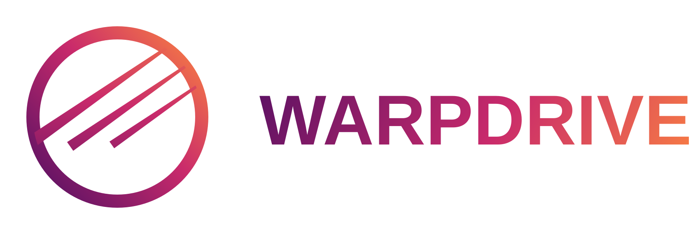

  

  
<strong>Object storage for systems and the agentic era</strong>

  
Fast by default. Explainable SLAs. Safely customizable.

  

    
    
    
    
    
    
    
    
  

📄 **Position Paper (Vision):** [*WarpDrive: A Composable Storage Substrate for Disaggregated Data Systems*](https://vldb.org/2026/Workshops/VLDB-Workshops-2026/CDMS/CDMS26_8.pdf), accepted as a **lightning talk at CMDS (Composable Data Management Systems), the VLDB 2026 workshop**.

---

## About

WarpDrive is an object store that's fast out of the box, tells you why it's fast enough to put in an SLA, and lets you customize how it places your data without risking the system coming down.

Run it as a **single node** to get a fully S3-compatible store in one process, a drop-in for local development and embedded use (see the compatibility results below). Run it **distributed** to get a multi-node, erasure-coded engine with no single coordinator, no leader election, and quorum-based reads/writes.

What makes WarpDrive different is **content-dependent placement**. Instead of treating every object as an opaque blob, a bucket can opt a workload's own structure (Parquet column chunks, vector-index partitions) into how its bytes are striped and erasure-coded, and the system reports the cost of that choice before it risks availability. Measured end-to-end against established tools, not synthetic benchmarks:

- **149x faster** on a selective, official TPC-H query (DuckDB, via its own `dbgen`). Pushdown skips untouched stripes instead of reconstructing the whole object.
- **Up to 41x faster** on Lance vector-search (`IVF_PQ`) `take` latency, with recall@10 identical to the unpacked baseline on the SIFT1M-small benchmark. Speed with no accuracy trade-off.

Full writeup, plots, and methodology: [`docs/benchmarks/v1.0.0-results.md`](docs/benchmarks/v1.0.0-results.md). Architecture for both modes: [Technical Architecture](docs/Technical-Architecture.md). Our longer-term direction: [Technical Roadmap](docs/Technical-Roadmap.md).

---

## Getting Started

See the [User Guide](docs/user_guide.md) for installation, configuration, and API usage examples.

## Performance Benchmarks

WarpDrive's content-dependent placement is measured against real tools and real data, not synthetic benchmarks. Full methodology, more queries/nprobe levels, and plots in [`docs/benchmarks/v1.0.0-results.md`](docs/benchmarks/v1.0.0-results.md).

| System | Type | Workload | Result |
|--------|------|----------|--------|
| [DuckDB](https://duckdb.org) | Analytical SQL engine | Official TPC-H (via `dbgen`), selective query (Q6) | **149x faster** (7756.6ms → 51.9ms) via row-group pushdown |
| [Lance](https://lancedb.github.io/lance/) | Vector search (`IVF_PQ`) | `take` latency, 20k vectors/768-dim | **Up to 41x faster**, recall@10 identical to baseline |
| Lance | Vector search (`IVF_PQ`) | SIFT1M-small (published benchmark corpus) | **Up to 5.5x faster**, recall@10 identical to baseline |

## Compatibility Tests

WarpDrive is tested against real-world storage clients and databases to validate S3 compatibility. Full results in [`docs/compatibility_tests/`](docs/compatibility_tests/).

| System | Type | Version Tested | Status | Notes |
|--------|------|---------------|--------|-------|
| [TidesDB](https://tidesdb.com) | Embedded LSM KV store | C library v9.3.6 / Rust crate 0.11.1 | ✅ Passing | [Full report](docs/compatibility_tests/tidesdb.md): object store mode, replication, 17/17 CI tests pass |
| [SlateDB](https://slatedb.io) | Embedded LSM KV store | slatedb 0.14 / object_store 0.14 | ✅ Passing | [Full report](docs/compatibility_tests/slatedb.md): 1000-key write/flush/read/range-scan/delete, ISO 8601 LastModified required |
| [Neon](https://neon.tech) | Serverless Postgres | neon main / aws-sdk-rust 1.3.3 | ✅ Passing | [Full report](docs/compatibility_tests/neon.md): pageserver + safekeeper backed by WarpDrive, full Postgres write/read verified |

**In pipeline:**

| System | Type |
|--------|------|
| [LangGraph](https://langchain-ai.github.io/langgraph/) | Agentic workflow orchestration |
| [LlamaIndex](https://www.llamaindex.ai) | RAG / agentic data framework |
| [Ray](https://ray.io) | Distributed ML training & serving |
| [PyTorch Lightning](https://lightning.ai) | ML training checkpointing |

## Developer's Corner
For more advanced usage and development details, visit the [Developer's Documentation](docs/setup.md).
