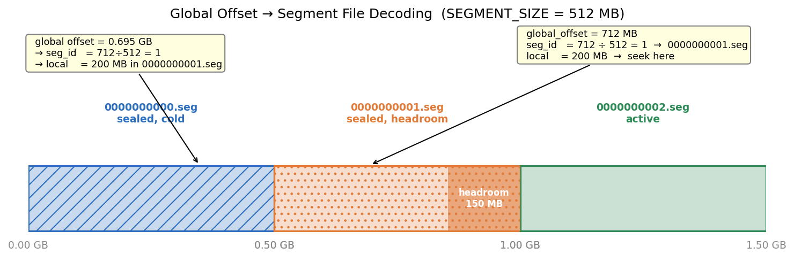
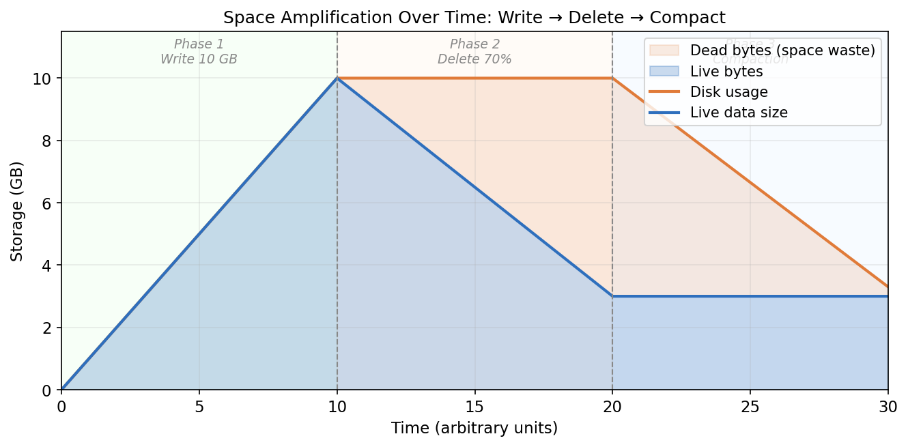
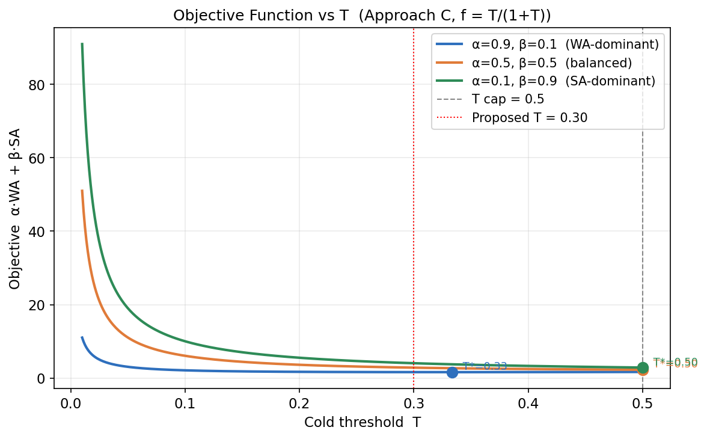
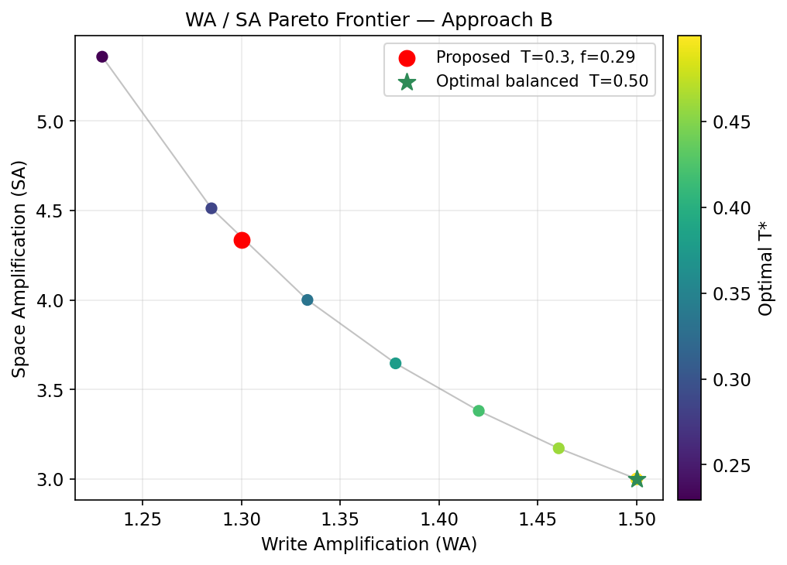
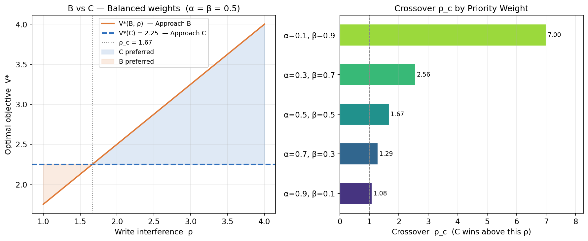
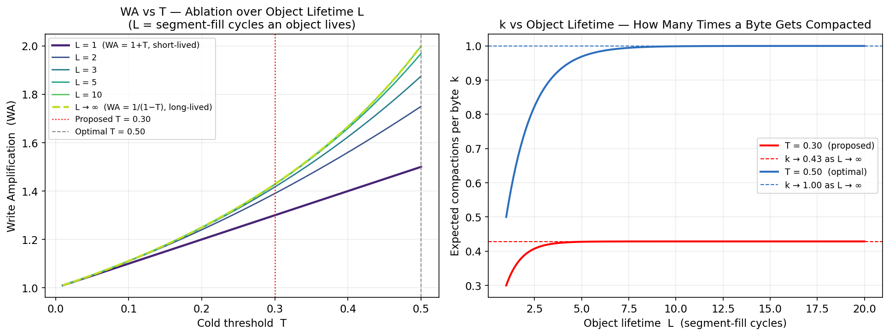

# RFC 3 — Segment-Based Storage with Space Reclamation

**Status:** Draft  
**Branch:** `feat/rfc-segment-storage`

---

## Problem

The current storage layer is a single append-only file per user/bucket. Object location is stored as `(offset, size)` extents in SQLite. Deletes queue the extents via the deletion WAL but the background worker has no way to actually reclaim space — the file grows forever with holes.

There is no compaction, no merging, and no way to shrink disk usage after objects are deleted or overwritten.

---

## Design Journey

This section records how each design decision was reached — what we observed, what we tried, why we changed direction. The goal is to make the final design legible: not just what it is, but why it isn't something simpler.

---

### Step 1 — Observing the problem: the file grows forever

The current layout is one flat append-only file per bucket at `storage/{bucket}`. Object metadata (offset, size) lives in SQLite. When an object is deleted, we remove the SQLite row and queue the extent in a deletion WAL. A background worker reads the WAL — but all it can do is note that those bytes are now dead. There is no mechanism to return them to the OS. The file only grows.

After any workload with significant churn (overwrites, lifecycle deletes), disk usage diverges from live data size. There is no compaction, no hole-punching, no reclaim path.

**Observation**: we need a storage layout where "freeing space" means deleting an entire file, not punching holes in a single large one.

---

### Step 2 — First attempt: compact within the flat file

The naive fix is to rewrite the flat file in place: scan for holes, copy live data forward, shrink the file. This breaks immediately:

- Every copy changes an offset. That means a SQLite UPDATE for every live object in the file — potentially millions of rows in one transaction.
- An incomplete compaction (crash mid-copy) leaves the file in an inconsistent state with no safe recovery path.
- Reads are blocked for the entire duration.

**Conclusion**: in-place compaction of a flat file is not viable. We need a layout where space can be reclaimed by deleting a self-contained unit without touching any other data.

---

> **Checkpoint 1 — Problem established**
> The current flat-file layout has no space reclaim path. Deletes remove the SQLite row but bytes stay on disk forever. In-place compaction is ruled out: it invalidates all offsets, is unsafe under crashes, and blocks reads. We need a layout where freeing space means deleting a whole file.

---

### Step 3 — Segments: reclaim a whole file at a time

Splitting the bucket storage into fixed-size segment files gives us that unit. A cold, under-utilized segment can be compacted by copying its survivors elsewhere and then deleting the entire `.seg` file. No other segment is touched.

The immediate concern: how do we encode segment identity in the metadata? Adding a `segment_id` column to SQLite is a schema migration across all existing data. We wanted to avoid that.

**Key insight**: the global offset already encodes segment identity via integer division. With `SEGMENT_SIZE = 512 MB`:

```
segment_id   = global_offset / SEGMENT_SIZE
local_offset = global_offset % SEGMENT_SIZE
```

The existing `(offset, size)` pairs in SQLite are unchanged. The reader just needs to compute two extra integers before opening the file. No migration, no schema change.



Each block is a 512 MB file on disk. The arrow shows how a single number — the global offset stored in SQLite — tells you exactly which file to open and where to seek inside it. No new columns, no mapping table. Reads just do two integer operations (divide and modulo) before opening the file.

---

### Step 4 — Utilization: how do we know when a segment is cold?

The first instinct was a separate per-segment counter table — increment on write, decrement on delete. This introduces two failure modes: counter drift on crash, and a new table that has to be kept in sync with the main `objects` table.

Then we noticed: the information already exists. A row in `objects` means the extent is live. No row means it is dead. To compute utilization for segment N, query the `objects` table for all extents that overlap segment N's byte range and sum them. No counter, no drift, no new table.

```sql
SELECT SUM(extent_size) FROM objects
WHERE extent_start >= N * SEGMENT_SIZE
  AND extent_start  < (N+1) * SEGMENT_SIZE
```



The orange region is wasted disk space — bytes that are dead but still occupy storage. In Phase 2, deleting 70% of the data drops live bytes immediately but disk usage stays flat. That gap is space amplification in action. Compaction in Phase 3 closes it by copying survivors out of cold segments and deleting those segment files entirely. Without compaction the orange region grows forever as the workload continues.

---

> **Checkpoint 2 — Storage structure decided**
> Storage splits into fixed-size 512 MB segment files per bucket. No schema change needed: the existing global offset encodes the segment file and seek position via integer divide and modulo. Segment utilization is computed on demand from the `objects` table — no counters, no new tables, no drift on crash. A segment is "cold" when the live bytes queried from SQLite fall below threshold T.

---

### Step 5 — Where do survivors go?

When we compact a cold segment, the live bytes have to go somewhere. Two options:

**Option A** — compact into the active segment. Simple: survivors are just appended like any other write. No structural change needed.

**Option B** — reserve headroom in `active - 1`, compact there. This completely separates fresh writes (active) from compaction writes (active - 1). The active segment is never touched by the compactor.

The motivation for B is architectural clarity: the active segment has a single writer and a single write pattern (append-only, sequential). Adding compaction writes would mean two concurrent writers with different access patterns on the same file.

Whether this actually hurts performance in practice — i.e., whether I/O interference between fresh writes and compaction writes is measurable — is an empirical question. We formulated a model to figure out when B is actually worth the extra complexity, and ran it before deciding.

---

### Step 6 — Formulating the optimization: what are the costs?

Before committing to either approach, we wanted a formal cost model. Two metrics:

- **WA (write amplification)** — how many times is each user byte written? Once fresh (cost 1), plus once per compaction it lives through. A byte gets compacted every time the segment it's in goes cold before the byte is deleted. The full model is `WA = 1 + k` where k depends on T and how long objects live — see the Analytical Modeling section.
- **SA (space amplification)** — how much disk does a byte occupy beyond its live size? At worst case utilization T, with headroom fraction f: `SA = 1 / (T * (1 - f))`.

The objective is to minimize `α*WA + β*SA` where α and β express how much you care about each.

**First attempt used CVXPY.** It failed — the product `(1 - f) * T` in the denominator of SA is not DCP-compliant (non-convex in the CVXPY sense when both are decision variables). We had to change the formulation.

**Fix**: the headroom feasibility constraint `f * S ≥ T * (1 - f) * S` gives `f ≥ T / (1 + T)`. Setting `f` to its minimum feasible value eliminates it as a free variable. SA becomes `(1 + T) / T` — now a single-variable problem.

The objective `α*(1 + T) + β*(1 + T)/T` is nonlinear because of the `β/T` term (a hyperbola). It is convex (`d²/dT² = 2β/T³ > 0`), so scipy's bounded scalar minimizer finds the global minimum trivially. We also derived a closed-form: `T* = sqrt(β/α)`, capped at 0.5.



Each curve is a different priority weighting. The dot marks where each curve hits its minimum — the optimal T for that weighting. For the balanced and SA-heavy curves the minimum sits at the right boundary (T = 0.5), not in the interior. The optimizer is always pushing toward compacting aggressively — lower T values just waste more space without improving write efficiency. The red dotted line at T = 0.30 (our proposed value) is deliberately conservative: we accepted worse SA in exchange for not compacting segments that might only be temporarily cold.

---

> **Checkpoint 3 — Cost model established**
> We have two knobs: T (cold threshold) and f (headroom fraction). Write amplification is WA = 1 + k, where k is the average number of times a byte gets compacted — it grows with object lifetime and with T. Space amplification is SA = (1+T)/T once headroom is set to its minimum feasible value f = T/(1+T). Both metrics are now functions of T alone. The optimizer finds T* = sqrt(β/α), capped at 0.5 — meaning T = 0.5, f = 0.33 is optimal for almost any weighting that cares about space at all. Our proposed T = 0.30 is intentionally conservative.

---

### Step 7 — What the optimizer told us about T

Running the closed-form across a range of α/β weights:

- For any α/β ratio where SA matters at all (β/α ≥ 1), `T* = 0.5` is optimal.
- Below that, T* = sqrt(β/α) — it shrinks only when WA is heavily dominant.
- The proposed `T = 0.30` is intentionally conservative relative to `T* = 0.50`. The gap: WA = 1.30 (vs optimal 1.50), SA = 4.33 (vs optimal 3.00). We are paying 44% worse SA to be conservative about compacting temporarily-cold segments.

**Decision to revisit**: bump the proposed threshold closer to T* = 0.45–0.50 after benchmarking confirms real-world utilization distributions.



Each point on the frontier is an operating point — a choice of T giving a specific WA/SA trade-off. Moving right means lower T: you compact less aggressively, giving less write amplification but more disk waste. Most of the frontier collapses to the same point (T = 0.5, WA = 1.5, SA = 3.0) because the optimizer hits the cap across most weightings. The proposed point (red) has worse SA than optimal — that is the cost of keeping T conservative at 0.30.

---

### Step 8 — Comparing A and B: when does headroom actually pay off?

The optimization above is for Approach B. But B has a cost: headroom is dead space until filled. At equal T, Approach A has strictly lower SA:

```
SA_A = 1 / T               (no headroom waste)
SA_B = (1 + T) / T         (headroom overhead)

At T = 0.5:  SA_A = 2.0,  SA_B = 3.0   (B is 50% worse)
```

WA is identical in both when there is no I/O interference. So at `ρ = 1`, A always wins.

We modeled interference as a multiplier `ρ ≥ 1` on B's effective WA and solved a bi-level program to find the crossover:

```
α = 0.5, β = 0.5:   ρ_c = 1.67    (A needs to slow writes 67% for B to win)
α = 0.9, β = 0.1:   ρ_c = 1.08    (WA-heavy: any contention tips to B)
α = 0.1, β = 0.9:   ρ_c = 7.00    (Space-heavy: B almost never wins)
```

This is the decision the benchmark has to resolve: measure actual ρ, compare to ρ_c.



Left: as ρ increases from 1 (no interference), Approach A's effective cost rises while B's stays flat. They cross at ρ_c = 1.67 — the point where B's headroom overhead is exactly offset by A's interference cost. Below the crossover A wins; above it B wins. Right: ρ_c shifts significantly by priority weighting. If you care mostly about write throughput (α = 0.9), almost any interference tips you to B (ρ_c = 1.08). If you care mostly about space (α = 0.1), you would need compaction to cause a 7× throughput drop before B is worth the extra headroom overhead. The benchmark's job is to measure actual ρ and place it on this chart.

---

> **Checkpoint 4 — Approach decision deferred to benchmarks**
> Without headroom (A): lower SA, but compaction and fresh writes share the active segment. With headroom (B): 50% worse SA at T = 0.5, but compaction is fully isolated in active-1. WA is the same in both. The decision reduces to a single measurement: ρ, the throughput slowdown compaction causes in A. If ρ < 1.67 (balanced weights), implement A. If ρ > 1.67, implement B. The benchmark is designed to measure this.

---

### Step 9 — Making compaction lock-free

The compaction process is naturally crash-safe and lock-free without any additional coordination:

1. **Copy** live bytes from the cold segment to the destination (pure I/O, no locks).
2. **Commit** all updated offsets in a single SQLite transaction.
3. **Queue** the old segment for deletion; background worker removes it after a grace period.

If the server crashes during step 1: the commit never happened, old offsets are valid, the old file still exists. Compaction restarts on the next GC cycle with no data loss.

For reads: a reader that fetches old offsets from SQLite before the commit continues reading from the old file (which still exists). A reader that fetches after the commit gets new offsets and reads from the new location. The one race — reading old offset, commit fires, file is deleted before the reader opens it — is handled by: (a) the grace period on deletion (in-flight readers finish before the file disappears), and (b) an `ENOENT` retry that re-reads the offset from SQLite, which by that point has the new value.

No mutexes. No read locks. No blocking the writer.

---

> **Checkpoint 5 — Design complete**
> We have a full design ready to implement. Segment files give us space reclamation without schema changes. Utilization comes from SQLite for free. The compaction process is crash-safe and lock-free: copy survivors → commit offsets atomically → delete old segment after a grace period. The one open question is whether to implement A or B, which the benchmark resolves by measuring ρ. Everything else — segment size, headroom, cold threshold — has optimal values derived from the cost model and can be tuned after benchmarking.

---

- **Writes stay append-only** — no seek-before-write, no in-place mutation
- **Reads stay O(1)** — direct seek by offset within a segment file
- **Space is actually reclaimed** — deleted object extents are freed by removing whole segment files
- **No metadata schema change** — the existing `(offset, size)` extent format is preserved; segment identity is encoded into the global offset
- **No new SQLite tables** — segment list comes from the filesystem, utilization computed from the existing `objects` table

---

## Design

### Segment Files

Storage is divided into fixed-size segment files per bucket:

```
storage/
  {bucket}/
    0000000000.seg    ← sealed, read-only
    0000000001.seg    ← sealed, has headroom reserved for compaction writes
    0000000002.seg    ← active, append-only (fresh writes only)
```

Each segment has a fixed maximum size `SEGMENT_SIZE` (proposed: 512 MB). The active segment is the highest-numbered one. Only one segment is written to at a time.

### Encoding: Global Offset

Segment identity is encoded directly into the global offset stored in SQLite. With `SEGMENT_SIZE = 512 MB = 536,870,912 bytes`, the virtual address space is:

```
Segment 0: bytes           0  →  536,870,911   → 0000000000.seg
Segment 1: bytes 536,870,912  → 1,073,741,823  → 0000000001.seg
Segment 2: bytes 1,073,741,824 → ...           → 0000000002.seg
```

At read time, one number gives you everything:

```
segment_id   = global_offset / SEGMENT_SIZE   → which file to open
local_offset = global_offset % SEGMENT_SIZE   → where to seek inside it
```

Example: object at local offset 200 MB inside segment 1 → global offset `736,870,912`. Decode: `736,870,912 / 512MB = 1` → open `0000000001.seg`, seek to `200,000,000`.

**No schema change.** The existing `offset_size_list` blob stores `(global_offset, size)` pairs unchanged.

### Write Path

A segment is sealed when it reaches `SEGMENT_SIZE - HEADROOM` bytes. The remaining `HEADROOM` is reserved for compaction writes only.

1. If `active_size + write_size ≤ SEGMENT_SIZE - HEADROOM`: append to active segment
2. Otherwise: seal active segment, open next segment, write there

Large writes that overflow are split into multiple extents (one per segment). The existing `offset_size_list` supports multiple extents per object — no schema change needed.

### Read Path

For each extent: decode `segment_id = offset / SEGMENT_SIZE`, `local_offset = offset % SEGMENT_SIZE`, open the file, seek, read. Concatenate across extents.

### Bucket Deletion

Delete the entire `storage/{bucket}/` directory. No per-object scan needed.

---

## Space Reclamation via Compaction

### Utilization — Computed On Demand

For segment N, live bytes come directly from the `objects` table. What is absent from the table is dead.

```
live_bytes(N) = SUM of bytes from extents in objects
                that overlap [N*SEGMENT_SIZE, (N+1)*SEGMENT_SIZE)
```

No counter maintained. No drift on crash.

### Headroom and Compaction Target

Each sealed segment reserves `HEADROOM = f * SEGMENT_SIZE` bytes. Compaction survivors are written into the headroom of `active - 1`, never the active segment. This is an architectural choice: the active segment is exclusively for fresh writes. There is no shared resource between the writer and the compactor.

```
Segment N-2:  [==live==|--dead--|  headroom  ]  ← cold target
Segment N-1:  [==live==|--dead--|  headroom  ]  ← compaction destination
Segment N:    [===fresh writes...            ]  ← active, untouched
```

Whether this separation actually prevents I/O contention in practice is an empirical question answered by benchmarks. If contention is negligible (Approach A), B pays a higher SA cost for cleanliness with no throughput benefit.

### Lock-Free Compaction

Compaction is a copy-before-commit operation. No locks are held at any point:

1. **Copy** — read live bytes from cold segment N into headroom of segment N-1 (pure I/O, no locks)
2. **Commit** — update all affected `offset_size_list` entries in a single SQLite transaction
3. **Unlink** — add segment N to the deletion queue; background worker removes it after a grace period

**Crash safety**: the cold segment file is not removed until after the SQLite commit. If the server crashes mid-copy, the commit never happened, old offsets in SQLite are still valid, and the old file still exists. Compaction restarts cleanly on the next GC cycle.

**Read safety without locks**: On Linux, `unlink()` removes the directory entry but keeps the file data accessible through open file descriptors. A reader that opened segment N before the unlink can still read from it. A reader that opens segment N after the commit gets new offsets from SQLite and opens N-1 instead.

The one race: a reader fetches old offset from SQLite, compaction commits and unlinks the file, then the reader tries to open the now-unlinked file and gets `ENOENT`. Fix: on `ENOENT`, re-read the offset from SQLite and retry once. By that point the commit has landed and the new offset points to the correct segment.

### Compaction Process

1. Compute utilization for all sealed segments except `active - 1`
2. Pick the lowest-utilization segment below `COLD_THRESHOLD T`
3. Copy its live bytes into the headroom of `active - 1` (no locks held)
4. Wrap all `offset_size_list` updates in a single SQLite transaction and commit
5. Add cold segment to deletion queue; background worker unlinks it after grace period

---

## Analytical Modeling

Two questions drive this section: what are the optimal values of T and f for Approach B, and is Approach B actually better than A?

**Symbols used:**
- `T` — cold threshold (0 to 0.5): compact a segment when its utilization falls below this fraction
- `f` — headroom fraction: what fraction of each segment is reserved for compaction writes
- `α, β` — how much you care about write amplification vs space amplification (α + β = 1)
- `ρ` — measured write interference: how much compaction slows concurrent fresh writes in Approach A

---

### Where WA and SA come from

**Write amplification** is how many times each user byte gets written in total. Every byte is written once fresh. After that, it may be copied again if its segment gets compacted — and then again if the segment it moved to also eventually goes cold.

We model this with two parameters:
- `T` — the cold threshold, which controls how aggressively we compact
- `L` — object lifetime measured in "segment-fill cycles" (how many times a fresh segment fills up during the object's life). `L = 1` means the object lives roughly as long as one segment takes to fill; `L = 10` means it survives ten fill cycles.

When a segment is compacted, T fraction of its bytes are still alive and get copied. In the next segment, the same logic applies — with probability T the byte survives to the next compaction. So the expected number of compactions k a byte goes through is:

```
k(T, L) = T × (1 - T^L) / (1 - T)

WA = 1 + k
```

The two limiting cases:
- `L = 1` (short-lived objects) → `k = T`, so `WA = 1 + T`
- `L → ∞` (objects live forever) → `k = T/(1-T)`, so `WA = 1/(1-T)`

In practice WA sits somewhere between these depending on how long your objects live relative to your compaction rate.



Left: each curve is a different object lifetime L. Short-lived objects (L = 1, bottom curve) are mostly deleted before their segment goes cold, so they rarely get compacted more than once — WA is low. Long-lived objects (L → ∞, top dashed curve) keep getting re-compacted every time their segment goes cold, driving WA toward 1/(1-T). The red and gray verticals mark the proposed (T = 0.30) and optimal (T = 0.50) operating points. Right: for a fixed T, k grows and then flattens as L increases — past a certain lifetime the byte almost always sees at least one compaction per cycle, so k converges to its asymptote T/(1-T).

The benchmark measures actual WA directly as total bytes written ÷ total user bytes written, which captures all of this without needing to know L. The model gives us the shape of the relationship; the benchmark pins the exact number.

**Space amplification** is the ratio of total disk used to actual live data. SA = 3 means you are using 3× as much disk as your data actually needs — two thirds of the storage is dead bytes waiting to be reclaimed.

The worst case for SA is a segment sitting just above the cold threshold — it has accumulated the maximum tolerable dead bytes and hasn't been compacted yet. Let's walk through a concrete example.

Take a 512 MB segment with T = 0.5 and no headroom (f = 0, Approach A):

```
Data capacity  = (1 - f) × S  =  (1 - 0) × 512 MB  =  512 MB
Live bytes     = T × 512 MB   =  0.5 × 512 MB        =  256 MB   ← half is dead
Disk used      = 512 MB       (the whole file is on disk)

SA  =  disk used / live bytes  =  512 / 256  =  2.0
```

For every 1 MB of real data you have, you're occupying 2 MB of disk. The other 1 MB is dead bytes that haven't been reclaimed yet.

Now add headroom for Approach B with T = 0.5 and f = 0.33 (headroom takes up 33% of the segment):

```
Data capacity  = (1 - 0.33) × 512 MB  =  342 MB
Live bytes     = T × 342 MB            =  0.5 × 342 MB  =  171 MB
Disk used      = 512 MB

SA  =  512 / 171  =  3.0
```

SA went from 2.0 to 3.0 just because of the headroom — 170 MB per segment is now permanently reserved and not counted as live data.

The general formula is:

```
SA  =  1 / (T × (1-f))
```

**What happens with a lower T?** Say T = 0.3 (Approach A, f = 0):

```
Live bytes  =  0.3 × 512 MB  =  154 MB   ← only 30% alive, 70% dead
SA  =  512 / 154  =  3.3
```

Lower T means you tolerate more dead bytes before compacting, so SA gets worse. This is the fundamental tension: aggressive compaction (high T) gives better SA but more write overhead.

**Tying f to T:** Headroom must be large enough to absorb all survivors when we compact a cold segment. A cold segment has `T×(1-f)×S` live bytes that need to fit into headroom `f×S`:

```
f×S  ≥  T×(1-f)×S
  f  ≥  T / (1 + T)
```

At T = 0.5: f ≥ 0.5/1.5 = 0.33. That's exactly the 33% we used above — it's the minimum headroom that guarantees survivors always fit.

Substituting f = T/(1+T) back into the SA formula:

```
SA  =  1 / (T × (1 - T/(1+T)))
    =  1 / (T × 1/(1+T))
    =  (1 + T) / T
```

Verified with our examples: at T = 0.5, SA = 1.5/0.5 = 3.0 ✓. At T = 0.3, SA = 1.3/0.3 = 4.3.

Now both WA and SA are functions of T alone — one knob controls the whole trade-off.

---

### Finding the best T for Approach B

We want to minimize a weighted combination of WA and SA. The optimizer uses the L = 1 approximation for WA (one compaction per byte lifetime) — a reasonable baseline until benchmarks tell us the actual object lifetime distribution:

```
minimize over T:    α × (1 + T)  +  β × (1 + T) / T

subject to:         0 < T ≤ 0.5
```

Setting the derivative to zero gives a clean closed form:

```
T* = sqrt(β / α),   capped at 0.5
f* = T* / (1 + T*)
```

What this says intuitively: if you care mostly about space (high β), you want a high T — compact aggressively and accept more write overhead. If you care mostly about write throughput (high α), you want a lower T — compact only when segments are very cold. The cap at 0.5 means the answer is T = 0.5 for most practical weightings:

| Priority | α | β | T* | f* | WA | SA |
|---|---|---|---|---|---|---|
| Only WA | 1.0 | 0.0 | → 0 | → 0 | → 1.0 | → ∞ |
| WA-heavy | 0.9 | 0.1 | 0.33 | 0.25 | 1.33 | 4.00 |
| Balanced | 0.5 | 0.5 | 0.50 | 0.33 | 1.50 | 3.00 |
| SA-heavy | 0.1 | 0.9 | 0.50 | 0.33 | 1.50 | 3.00 |
| Only SA | 0.0 | 1.0 | → ∞ | → 1 | → ∞ | → 1.0 |

The pure extremes (only WA or only SA) are degenerate — one wastes all disk, the other rewrites all data constantly. For anything in between, T = 0.5 and f = 0.33 is the answer.

---

### Comparing Approach A vs Approach B

At equal T, the two approaches have the same WA (both compact the same bytes the same number of times) but differ in SA:

```
Approach A (no headroom):   WA = 1 + k,   SA = 1 / T
Approach B (with headroom): WA = 1 + k,   SA = (1 + T) / T
```

B always has worse SA — headroom is dead space until used. The only thing that makes B worth it is if compaction into the active segment (Approach A) measurably slows fresh writes.

We define `ρ` as the throughput ratio: `ρ = throughput_idle / throughput_during_compaction`. A value of 1.5 means compaction makes writes 33% slower. We solve each approach independently for its optimal T, then compare their minimum costs:

```
Cost_A(ρ) = minimized over T:  α×(1+T)×ρ  +  β/T
Cost_B     = minimized over T:  α×(1+T)    +  β×(1+T)/T
```

B is worth adopting when `Cost_A(ρ) > Cost_B`, which happens past a crossover value ρ_c:

| α | β | ρ_c | Plain English |
|---|---|---|---|
| 0.9 | 0.1 | 1.08 | Any interference at all tips to B |
| 0.5 | 0.5 | 1.67 | B wins if compaction slows writes by 67% |
| 0.1 | 0.9 | 7.00 | B almost never wins — space overhead is too high |

At zero interference (ρ = 1), A always wins. The benchmark measures ρ, then this table decides which approach to implement.

---

### Benchmark Plan

Benchmarks serve two purposes: validate the model predictions for WA and SA, and measure `ρ` to determine which approach to implement.

1. **Write throughput** — sequential write of 10 GB at object sizes 1 KB / 1 MB / 100 MB. Measure MB/s sustained.
2. **Read latency** — random reads across a 10 GB dataset after compaction. Measure p50/p99 latency and MB/s.
3. **Space reclaimed** — write 10 GB, delete 70%, run one compaction cycle. Measure bytes on disk before/after and wall time.
4. **Measured WA** — instrument total bytes written during workload + compaction. Compare to model prediction `1 + T`.
5. **Write interference `ρ`** — run Approach A with concurrent fresh writes during compaction. `ρ = throughput_idle / throughput_during_compaction`. Compare against `ρ_c` to determine which approach wins.

Results will be added to this RFC. If measured `ρ < ρ_c`, we implement A. If `ρ > ρ_c`, we implement B. The optimizer script `optimize.py` can be re-run with measured `ρ` to refine the recommended constants.

---

## Migration from Current Layout

Current layout: one flat file per bucket at `storage/{bucket}`.

1. Detect if `storage/{bucket}` is a plain file
2. Rename to `storage/{bucket}_migrate`
3. Create `storage/{bucket}/` directory
4. Move to `storage/{bucket}/0000000000.seg`
5. Set active segment to `0000000001.seg`

Existing offsets decode to `segment_id = 0` for files under 512 MB. Files exceeding 512 MB require a split migration with offset rewrite (separate step).

---

## Constants (Proposed)

| Constant | Value | Derivation |
|---|---|---|
| `SEGMENT_SIZE` | 512 MB | Design choice: amortizes overhead, compacts in seconds |
| `HEADROOM` | 150 MB (29%) | Near f* = 33% from optimization |
| `COLD_THRESHOLD` | 30% | Slightly below T* = 50%; conservative to avoid false-cold |
| `MIN_AGE` | 1 hour | Avoid compacting recently-sealed segments |
| `COMPACTION_BATCH` | 1 segment per GC cycle | Bounds GC cycle duration |

---

## Non-Goals

- In-place defragmentation within a segment
- Cross-bucket compaction
- Replication or erasure coding (separate RFC)
