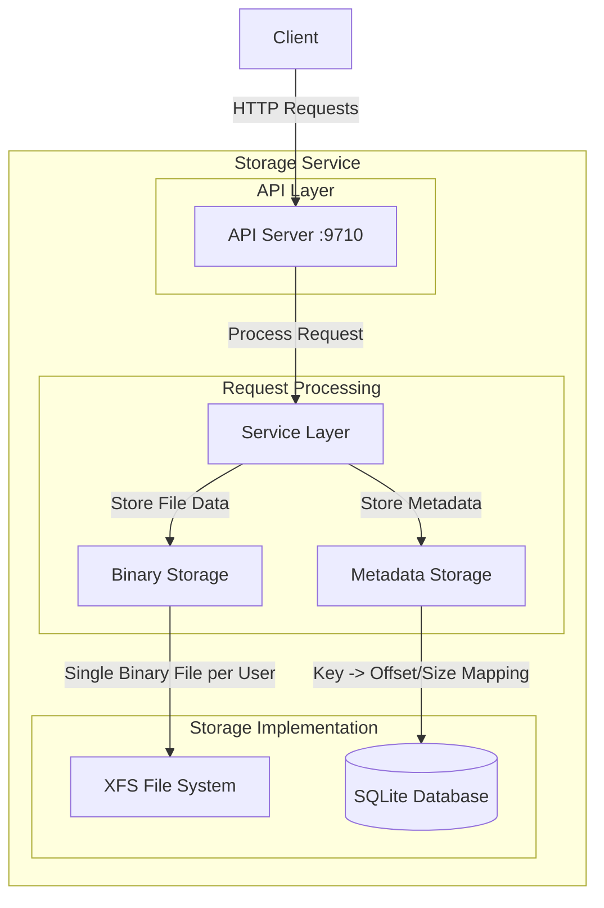

# CIAOS Architecture Documentation

## Introduction

CIAOS is a high-throughput key-value/object store optimized for Storage Disaggregated Architectures and AI/ML workloads. The implementation is based on Facebook's 2008 Haystack paper,
focusing on efficient storage and retrieval of objects through a simplified architecture.

## System Architecture - v0.0.0

