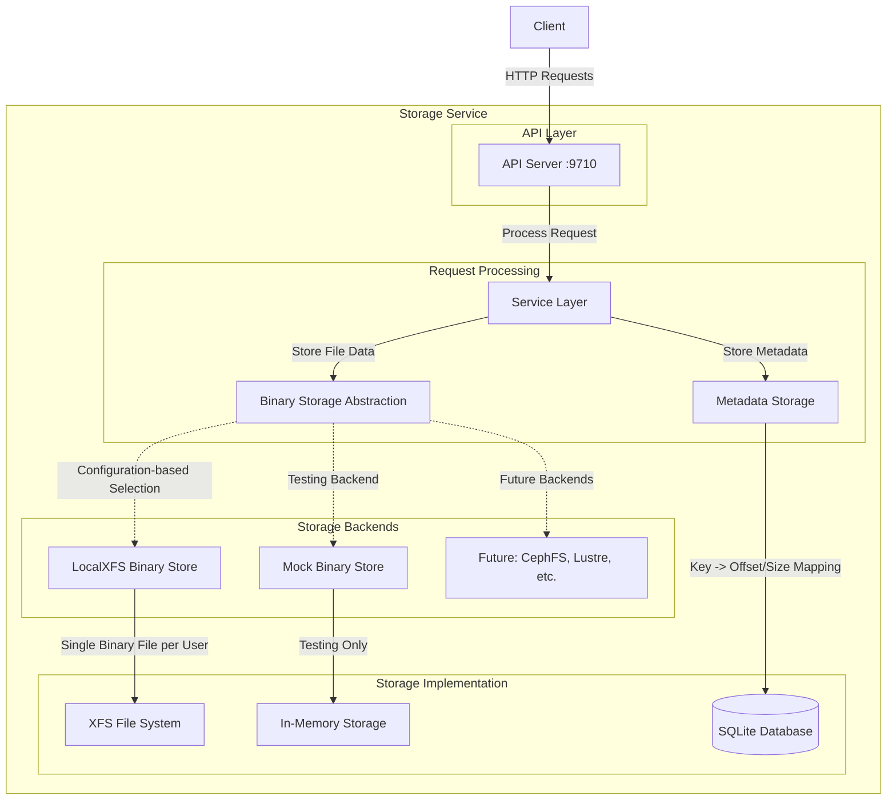

# CIAOS Architecture Documentation

## Introduction

CIAOS is a high-throughput key-value/object store optimized for Storage Disaggregated Architectures and AI/ML workloads. The implementation is based on Facebook's 2008 Haystack paper,
focusing on efficient storage and retrieval of objects through a simplified architecture.

## System Architecture - v0.1.0

## Binary Storage Abstraction Layer

The Binary Storage layer has been abstracted behind a trait-based interface to enable:

- **Backend Swapping**: Switch between storage implementations without changing service logic
- **Future Extensibility**: Support for distributed file systems (CephFS, Lustre, JuiceFS)
- **Testing**: Mock implementation for unit testing without disk I/O
- **Configuration**: Environment variable-based backend selection

### Available Backends

- **LocalXFS** (default): Current file-per-user approach with XFS filesystem optimization
- **Mock** (testing): In-memory storage for testing scenarios

### Configuration

The storage backend is selected via the `STORAGE_BACKEND` environment variable:
- `STORAGE_BACKEND=localxfs` or unset: Uses LocalXFS backend  
- `STORAGE_BACKEND=mock`: Uses Mock backend (testing only)
