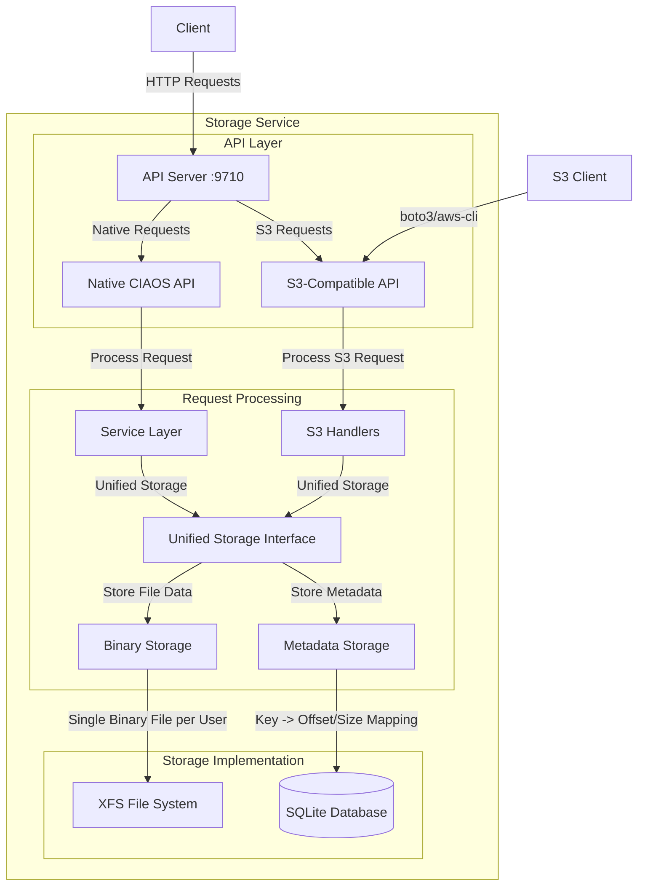
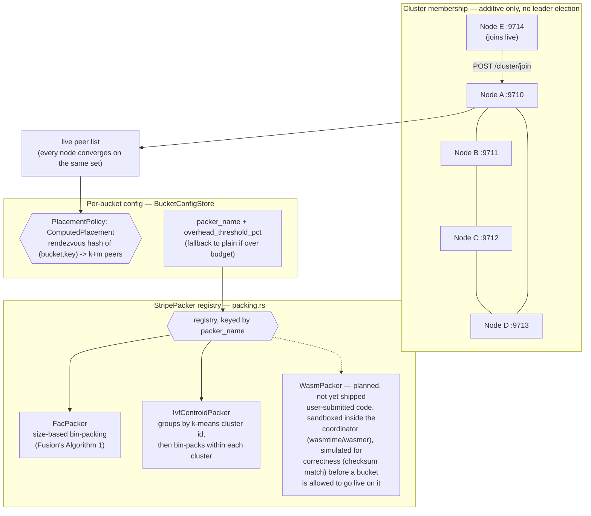
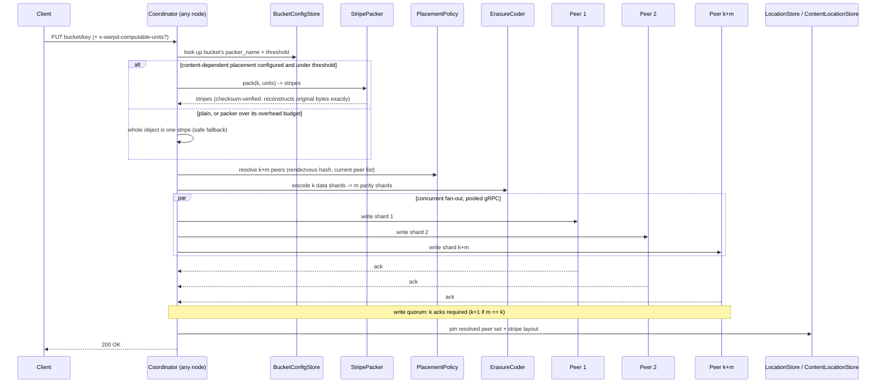
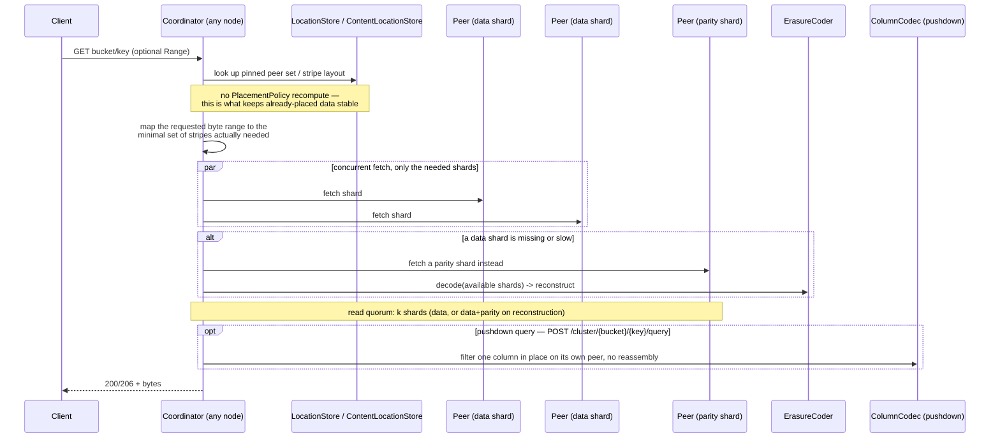

# WarpDrive Architecture Documentation

## Introduction

WarpDrive is a high-throughput key-value/object store optimized for Storage Disaggregated Architectures and AI/ML workloads. The implementation is based on Facebook's 2008 Haystack paper,
focusing on efficient storage and retrieval of objects through a simplified architecture.

As of **v1.0.0**, WarpDrive runs in two modes:

- **Single-node mode** — a single process, fully S3-compatible, for local
  deployments and development. This is the original architecture below,
  unchanged.
- **Distributed mode** — a multi-node, erasure-coded object engine with
  pluggable placement, built as a layer in front of the same single-node
  storage/API code (every peer is still a single-node server underneath).
  See [Distributed Mode](#distributed-mode---v100) below, and the measured
  results in
  [`docs/benchmarks/v1.0.0-results.md`](benchmarks/v1.0.0-results.md).

## Single-Node Mode (fully S3-compatible, for local deployments) - v0.1.0

```mermaid
graph TD
    subgraph "Storage Service"
        subgraph "API Layer"
            API[API Server :9710]
            NATIVE[Native CIAOS API]
            S3API[S3-Compatible API]
        end

        subgraph "Request Processing"
            SVC[Service Layer]
            S3HANDLER[S3 Handlers]
            UNIFIED[Unified Storage Interface]
            BIN[Binary Storage]
            META[Metadata Storage]
        end

        subgraph "Storage Implementation"
            XFS[XFS File System]
            DB[(SQLite Database)]
        end

        API -->|Native Requests| NATIVE
        API -->|S3 Requests| S3API
        NATIVE -->|Process Request| SVC
        S3API -->|Process S3 Request| S3HANDLER
        SVC -->|Unified Storage| UNIFIED
        S3HANDLER -->|Unified Storage| UNIFIED
        UNIFIED -->|Store File Data| BIN
        UNIFIED -->|Store Metadata| META
        BIN -->|Single Binary File per User| XFS
        META -->|Key -> Offset/Size Mapping| DB
    end

    C[Client] -->|HTTP Requests| API
    S3CLIENT[S3 Client] -->|boto3/aws-cli| S3API
```

## Distributed Mode - v1.0.0

Every deployed node is **symmetric** — the same binary, both a storage node
(the single-node architecture above, unchanged) and a coordinator that can
accept a request, decide placement, and fan out to peers. There is no
dedicated coordinator process and no leader election: consistent with how
MinIO and SeaweedFS run in production, placement is a deterministic function
of `(bucket, key)`, and consistency comes from a read/write quorum, not
consensus.

The write path and the read path are deliberately asymmetric, so it's worth
looking at them separately, plus a third diagram for how a bucket's
placement/packer choice actually gets wired up across the cluster's nodes.

### Cluster membership and per-bucket placement configuration

```mermaid
flowchart TB
    subgraph CLUSTER["Cluster membership — additive only, no leader election"]
        NA["Node A :9710"]
        NB["Node B :9711"]
        NC["Node C :9712"]
        ND["Node D :9713"]
        NE["Node E :9714\n(joins live)"]
        NA --- NB
        NB --- NC
        NC --- ND
        ND --- NA
        NE -.->|"POST /cluster/join"| NA
    end

    NA --> PEERS["live peer list\n(every node converges on the same set)"]
    PEERS --> PP

    subgraph BUCKET["Per-bucket config — BucketConfigStore"]
        PP{{"PlacementPolicy: ComputedPlacement\nrendezvous hash of (bucket,key) -> k+m peers"}}
        CFG["packer_name + overhead_threshold_pct\n(fallback to plain if over budget)"]
    end

    CFG --> REG

    subgraph REGISTRY["StripePacker registry — packing.rs"]
        REG{{"registry, keyed by packer_name"}}
        FAC["FacPacker\nsize-based bin-packing\n(Fusion's Algorithm 1)"]
        IVF["IvfCentroidPacker\ngroups by k-means cluster id,\nthen bin-packs within each cluster"]
        WASMP["WasmPacker — planned, not yet shipped\nuser-submitted code, sandboxed inside the\ncoordinator (wasmtime/wasmer), simulated for\ncorrectness (checksum match) before a bucket\nis allowed to go live on it"]
    end

    REG --> FAC
    REG --> IVF
    REG -.-> WASMP
```

A bucket only ever names a `packer_name` — swapping in a new packer (native
or, once built, WASM) never changes `coordinator.rs` or any client-visible
behavior, only which registry entry a bucket's config points at.

### Write path

Placement is resolved **fresh** on every write and then pinned — this is
what makes "a node joining later never moves existing data" actually true.

```mermaid
sequenceDiagram
    participant C as Client
    participant Co as Coordinator (any node)
    participant BC as BucketConfigStore
    participant SP as StripePacker
    participant PP as PlacementPolicy
    participant EC as ErasureCoder
    participant P1 as Peer 1
    participant P2 as Peer 2
    participant PN as Peer k+m
    participant LS as LocationStore / ContentLocationStore

    C->>Co: PUT bucket/key (+ x-warpd-computable-units?)
    Co->>BC: look up bucket's packer_name + threshold
    alt content-dependent placement configured and under threshold
        Co->>SP: pack(k, units) -> stripes
        SP-->>Co: stripes (checksum-verified: reconstructs original bytes exactly)
    else plain, or packer over its overhead budget
        Co->>Co: whole object is one stripe (safe fallback)
    end
    Co->>PP: resolve k+m peers (rendezvous hash, current peer list)
    Co->>EC: encode k data shards -> m parity shards
    par concurrent fan-out, pooled gRPC
        Co->>P1: write shard 1
        Co->>P2: write shard 2
        Co->>PN: write shard k+m
    end
    P1-->>Co: ack
    P2-->>Co: ack
    PN-->>Co: ack
    Note over Co,PN: write quorum: k acks required (k+1 if m == k)
    Co->>LS: pin resolved peer set + stripe layout
    Co-->>C: 200 OK
```

### Read path

GET and DELETE **never** call `PlacementPolicy` — they read the pin that the
write path already recorded, regardless of what the peer list looks like
now.

```mermaid
sequenceDiagram
    participant C as Client
    participant Co as Coordinator (any node)
    participant LS as LocationStore / ContentLocationStore
    participant P1 as Peer (data shard)
    participant P2 as Peer (data shard)
    participant P3 as Peer (parity shard)
    participant EC as ErasureCoder
    participant PD as ColumnCodec (pushdown)

    C->>Co: GET bucket/key (optional Range)
    Co->>LS: look up pinned peer set / stripe layout
    Note over Co,LS: no PlacementPolicy recompute —<br/>this is what keeps already-placed data stable
    Co->>Co: map the requested byte range to the<br/>minimal set of stripes actually needed
    par concurrent fetch, only the needed shards
        Co->>P1: fetch shard
        Co->>P2: fetch shard
    end
    alt a data shard is missing or slow
        Co->>P3: fetch a parity shard instead
        Co->>EC: decode(available shards) -> reconstruct
    end
    Note over Co,P3: read quorum: k shards (data, or data+parity on reconstruction)
    opt pushdown query — POST /cluster/{bucket}/{key}/query
        Co->>PD: filter one column in place on its own peer, no reassembly
    end
    Co-->>C: 200/206 + bytes
```

**What each piece is, concretely (not aspirational — all shipped and tested
unless marked "planned"):**

- **`PlacementPolicy`** (`placement.rs`) — `ComputedPlacement`, a CRUSH-style
  deterministic hash of `(bucket, key)` to a `k+m` peer set. Resolved fresh at
  PUT time and pinned into `LocationStore`; GET/DELETE read the pin, so a
  node joining or leaving never moves already-placed data.
- **`StripePacker`** (`packing.rs`) — pluggable **content-dependent
  placement**, the opt-in layer on top of the always-on default above.
  `FacPacker` (Fusion's Algorithm 1, size-based bin-packing) and
  `IvfCentroidPacker` (groups by k-means cluster id, then bin-packs
  within each cluster) are both registered implementations of the same
  trait — a bucket picks one via `BucketConfigStore`, or uses neither and
  gets plain erasure-coded storage. **Planned, not yet shipped:**
  `WasmPacker` — a user-submitted packer compiled to WASM, run sandboxed
  inside the coordinator process (no syscalls/network/filesystem access,
  resource-limited), simulated against a checksum of the original bytes
  for correctness before a bucket is ever allowed to go live on it. Same
  trait, same registry, same call site — only the authoring path changes.
- **`ErasureCoder`** (`ec.rs`) — `ReedSolomonCoder`, the `reed-solomon-erasure` crate
  encode/decode, with a second `encode_shards`/`decode_shards` path for
  pre-packed (content-dependent) stripes.
- **`LocationStore` / `ContentLocationStore`** (Bitcask-style: append-only
  log + in-memory index) — the plain object → peer-set pin, and the
  multi-stripe unit → (offset, stripe, peers) record content-dependent
  placement needs, kept as two stores since the record shapes genuinely
  differ.
- **`cluster/s3_shim.rs`** — a minimal S3 surface (GET/PUT/HEAD/List)
  over the same coordinator path, built specifically so third-party clients
  that need bucket/list semantics (Lance's `object_store::aws`) work
  unmodified, not just protocol-agnostic range-GET clients (DuckDB's
  `httpfs`, which needs no shim).
- **`pushdown.rs`** — a `ColumnCodec` trait + a `/query` endpoint that filters
  a column in-place on the peer holding it, no whole-object reassembly.
- **Membership** — additive only (SeaweedFS/MinIO-pool style): a new node
  calls `/cluster/join`, is added to the live peer list, and starts taking
  new writes immediately. Already-placed objects are never rebalanced —
  documented non-goal, not an oversight (see
  `docs/Distributed-Engine-Plan.md`).

Measured results for content-dependent placement, run against this engine
(Lance IVF_PQ vector search, the SIFT1M-small benchmark data, official
TPC-H via DuckDB's `dbgen` and query set) are in
[`docs/benchmarks/v1.0.0-results.md`](benchmarks/v1.0.0-results.md).

