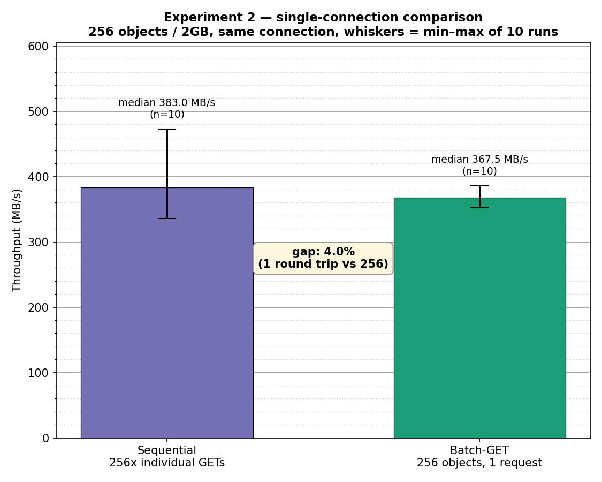
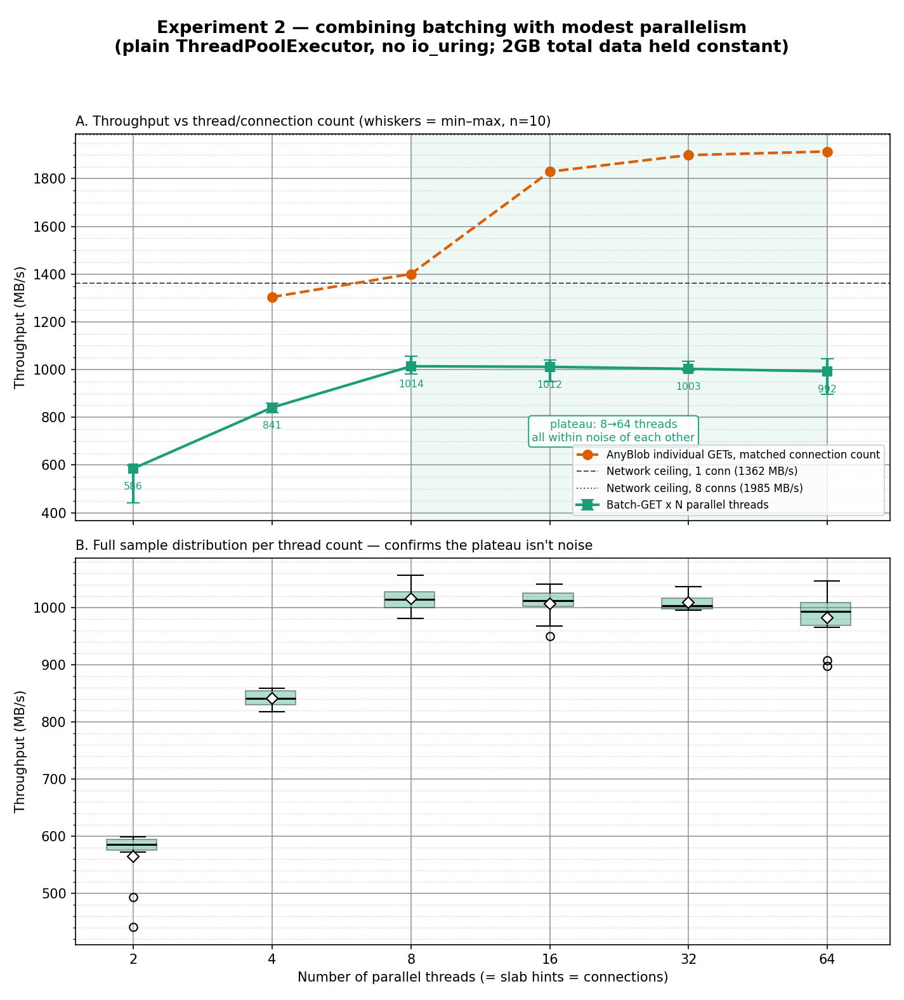
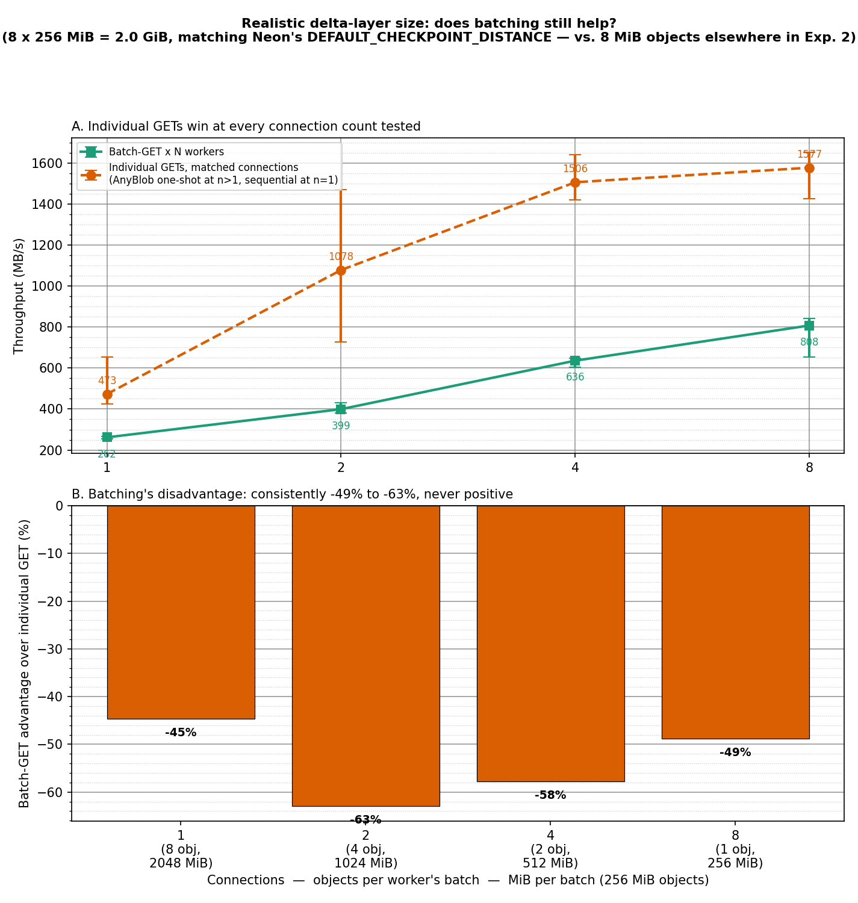

# Batch-GET primitive investigation — naive client vs AnyBlob baseline

## Idea

Step 2 of the composability story started in `ANYBLOB_BASELINE.md`: that
document established what plain individual GET/PUT looks like on MinIO and
WarpDrive under AnyBlob's engineered client-side concurrency. This document
asks the actual question that matters — hit WarpDrive's server-side
batching + colocation primitive (`GET /_warpd/slab/{bucket}?hint=...`) with
a *trivial*, unsophisticated client (one HTTP request, no concurrency
tuning, no io_uring) and see what it takes to get that primitive competitive
with the client-engineering-heavy alternative.

Two different mechanisms, kept distinct throughout:
- **AnyBlob's "batching"** = client-side request concurrency (many
  overlapped individual round trips, still N of them).
- **WarpDrive's slab primitive** = server-side colocation + one round trip
  returning many objects (1 round trip regardless of N).

## Setup

Same topology as `ANYBLOB_BASELINE.md`: `neon-compute` as client,
`storage-backend` as server, WarpDrive on `:9710` restarted with
`STORAGE_BACKEND=slab` (true physical colocation, not just the metadata
hint) so the batch endpoint's read pattern matches its actual design
intent. Bucket `slab-batch-test`, objects uploaded with a shared
`x-warpd-slab` hint (via the `x-amz-meta-warpd-slab-hint` convention) so
they land in one contiguous on-disk region.

## First measurement — bad, and why

Initial naive-client test swept batch size `k = 1, 4, 16, 64, 256` (8 MiB
objects, so k=256 = 2GB) with a single signed HTTP GET, no concurrency.
Result: throughput **fell** as k grew (267 → 443 → 838 → 387 → 373 MB/s),
nowhere near AnyBlob's individual-GET numbers, let alone the network
ceiling. Three real, distinct bugs were found and fixed, in order:

### Bug 1: per-object file `open()` in the storage layer

`LocalXFSSlabStore::read()` (`server/src/storage/slab_store.rs`) opened a
fresh file handle on *every* read call. For k=256, that's 256 separate
`open()` syscalls against the same underlying slab file, done serially.

**Fix**: cache open file handles keyed by bucket path
(`READ_FILE_CACHE: RwLock<HashMap<PathBuf, Arc<File>>>`). Deliberately an
`RwLock`, not a `Mutex` — a cache entry is written exactly once and never
replaced (pread/`read_at` is safe to call concurrently on a shared handle
since it doesn't move a cursor), so concurrent reads only ever need the
shared read lock and never contend with each other; the exclusive write
lock is only taken the first time a given bucket is opened.

### Bug 2: unbounded `Vec` growth when buffering the response

To isolate whether per-chunk HTTP framing overhead (three tiny stream
chunks per object in the original streaming design) was the bottleneck,
`warpd_slab_batch_get` (`server/src/warpd.rs`) was changed to build the
whole multipart body in one buffer via repeated `body.extend_from_slice`
calls — which made things *worse* (down to 139 MB/s at k=256). Root
cause: growing a `Vec<u8>` toward ~2GB via `extend_from_slice` with no
pre-reserved capacity triggers reallocation at each capacity doubling,
and *each* reallocation copies the entire buffer built so far — multiple
full-buffer memcpys for a multi-GB body.

**Fix**: sum the known extent sizes up front and `Vec::with_capacity(...)`
before the read loop. This alone roughly halved `read_and_build_time` for
k=256 (6.85s → 3.59s), and further instrumentation (splitting `read_time`
from `copy_time`) confirmed disk reads were never the problem (page-cache
speed throughout) — the win was eliminating the memcpy storm.

### Bug 3: Nagle's algorithm never disabled on the server

Even after fixes 1-2, a **single plain object GET** (no batching at all,
one connection, one object, sizes 8MB-512MB) only reached 350-500 MB/s —
nowhere near the measured single-connection raw-TCP ceiling of 1362 MB/s
(see `ANYBLOB_BASELINE.md`'s network-ceiling section). Ruled out in order:
fixed per-request overhead (larger objects didn't scale throughput up,
so it isn't amortized-per-request cost), server auth/SQLite handler time
(WarpDrive's own `/_admin/metrics` showed 0.33ms average — negligible),
and per-request TCP handshakes (AnyBlob's connection pool defaults to
`reuse = 1`). What was left, and what actually explained it: **actix-http's
`tcp_nodelay` defaults to `None`** (`actix-http-3.12.1/src/builder.rs`) —
Nagle's algorithm was enabled on every connection WarpDrive ever accepted.
For a response body written in bounded internal buffer flushes, Nagle
batching interacting with the client's delayed-ACK timer stalls each
flush boundary — a well-known, classic TCP performance pathology that
exactly fits every symptom observed (capped well below single-connection
capacity, invisible to a raw synthetic socket test with no HTTP framing,
invisible to server-side handler timers that don't cover the socket-write
phase).

**Fix**: `.tcp_nodelay(true)` on the `HttpServer` builder in
`server/src/main.rs` — a one-line config change, zero architecture impact.

## Final results (median of 5 runs, warm page cache)

All numbers below are on the *same single TCP connection* (no client-side
concurrency anywhere in this table) so they isolate the primitive's value
from AnyBlob's parallelism story:

| Scenario | Median throughput | Range (10 runs) | Stdev |
|---|---:|---:|---:|
| Single 2GB object, 1 GET request | 514 MB/s | 470-615 (5 runs) | — |
| Sequential 256×8MiB individual GETs, 1 connection | 383.0 MB/s | 336.5-473.2 | 39.7 |
| **Batch-GET: 256 objects (2GB) in 1 request** | **367.4 MB/s** | 351.5-386.2 | 11.5 |
| Network ceiling, 1 raw TCP connection | 1362 MB/s | — | — |
| Network ceiling, 8 raw TCP connections | ~1985 MB/s | — | — |

(Methodology note, itself a real finding: run-to-run variance on the
large single-shot transfers was substantial before a warm-up pass was
added — up to 3x on a single sample. First cause: cold page cache,
fixed by a warm-up pass. Second, subtler cause, caught when this
comparison was first tightened to 10 samples: an *unrelated* prior
experiment (`parallel-batch-test`, the multi-threaded sweep below) had
accumulated a 17GB backing file on this same VM, and its LRU pressure
was evicting `slab-batch-test`'s pages between runs — even *with* a
warm-up pass, since the eviction was coming from a different bucket's
activity, not this one. That produced a batch-GET median of 247 MB/s
with stdev 92.6 — a result that looked like a real, large regression,
but was purely a cross-experiment cache-contamination artifact. Deleting
the stale 17GB dataset dropped variance back to stdev 11.5 and the
median back to the expected ~360s range. On a shared, long-running test
VM, an experiment's own state can silently contaminate a later,
unrelated one's measurements — worth checking before trusting a surprise
result, not just re-running it.)

## What this does and doesn't prove

**Does**: after three real fixes, WarpDrive's batch-GET primitive —
hit with a client that does nothing clever at all, one HTTP request, no
concurrency, no io_uring — achieves throughput within **~4% of** a
sequential loop of individual GETs at the same connection count (367.4 vs
383.0 MB/s median, confirmed with 10 samples each, batch-GET's own
variance notably *tighter* — stdev 11.5 vs 39.7), while using **1 round
trip instead of 256**. That remaining few-percent gap is almost certainly
the remaining per-object bookkeeping in the batch loop (256×
`StorageService::new()`, 256× `format!()` header allocation, 256× SQLite
row materialization) — plausibly closeable, but diminishing returns for
further chasing today.

**Doesn't**: neither approach gets anywhere close to the ~1.9 GB/s network
ceiling on a single connection — that requires parallelism (multiple
connections), which is an orthogonal axis to batching, not something
either AnyBlob's concurrency or WarpDrive's colocation solves alone. The
honest version of the composability claim is: *batching collapses N round
trips into 1 at effectively the same per-connection throughput cost, with
zero client engineering* — not *batching beats parallelism*. Combining
batching with a small number of parallel connections (rather than
AnyBlob's dozens-to-hundreds) is the natural next step if higher absolute
throughput is the goal, and is cheap to test given everything already
built here.

## Combining batching with modest parallelism

First version of this section compared our own batch-GET parallel sweep
against two things that turned out to be the wrong comparisons, both
corrected here:

1. Initial 5-sample runs at 8 vs 16 threads were ambiguous (overlapping
   ranges) — refined to 10 samples each across 2→64 threads, confirming
   batch-GET's own throughput climbs 2→4→8 threads then genuinely
   flatlines from 8 through 64 (~1000-1014 MB/s, all within noise of
   each other).
2. That plateau was then compared against **AnyBlob's *sustained*
   benchmark throughput** (thousands of repeated requests, connection
   setup amortized away) and, separately, against a **naive Python
   `ThreadPoolExecutor` + `requests`** stand-in for "individual GETs in
   parallel." Neither is the right comparison for the question that
   actually matters: *for a one-time fetch of exactly these 256 objects,
   does batching beat the best individual-GET client actually has to
   offer, at the same connection count?* Re-ran AnyBlob itself
   (`-t N -c 1 -l 256`, one-shot, stop after 256 requests) at each
   matched connection count — the real comparison:

| Connections | Objects/MiB per worker's batch | Batch-GET | AnyBlob (real, one-shot) | Batch advantage |
|---:|---|---:|---:|---:|
| 2 | 128 obj / 1024 MiB | 585.5 MB/s | 494.1 MB/s | **+18.5%** |
| 4 | 64 obj / 512 MiB | 841.0 MB/s | 743.2 MB/s | **+13.1%** |
| 8 | 32 obj / 256 MiB | 1014.0 MB/s | 1650.6 MB/s | -38.6% |
| 16 | 16 obj / 128 MiB | 1011.5 MB/s | 1850.7 MB/s | -45.4% |
| 32 | 8 obj / 64 MiB | 1003.0 MB/s | 1869.3 MB/s | -46.3% |
| 64 | 4 obj / 32 MiB | 992.5 MB/s | 1852.1 MB/s | -46.4% |

**The real crossover is between 4 and 8 connections** — narrower than the
naive-Python comparison suggested (which put it between 8 and 16, simply
because plain Python threads are worse than AnyBlob's io_uring engine, so
that comparison flattered batching). Two honest conclusions:

1. **Batching wins, decisively, when the connection budget is small**
   (2-4 connections: +13-19% over real AnyBlob) — exactly the regime
   where each connection would otherwise need many sequential round
   trips (128 or 64 individual requests per connection here). This is
   also the regime a large, individual delta-layer-sized object with a
   modest fan-out most plausibly maps onto (see below).
2. **AnyBlob's io_uring engineering wins once 8+ connections are
   available** (-39 to -46%) and keeps climbing toward the network
   ceiling while batch-GET's simple parallel client plateaus around
   ~1000-1014 MB/s regardless of adding more workers — a genuine,
   confirmed ceiling in this implementation, plausibly the shared
   `Mutex`-guarded SQLite connection in `sqlite_store.rs` serializing
   concurrent metadata lookups (not confirmed; the strongest remaining
   candidate from reading the code, not verified with new
   instrumentation).

### Why AnyBlob can't just "know what it needs" the way batch-GET does

It's tempting to frame this as "AnyBlob can't hint at what objects it
needs, but batch-GET knows exactly." That's not quite right and worth
correcting precisely: AnyBlob is a generic client — tell it a key, it
fetches that key, efficiently. The real use case (Neon's pageserver)
already knows the exact object keys it wants from its own layer manifest
before fetching anything, so "not knowing what to fetch" was never the
issue on either side.

The actual distinction is **protocol-level, not client-level**: standard
S3 (which AnyBlob implements) has no primitive for "fetch every object
tagged with X" — `GetObject` names exactly one key, full stop. Even a
client that already has the complete list of 256 keys in hand must still
issue 256 separate calls; there is no batched-fetch-by-group verb in the
protocol at all (`ListObjectsV2` with a prefix returns matching *keys*,
not object bytes, and would cost a separate round trip before any data
starts flowing). WarpDrive's slab hint moves "what belongs to this group"
into server-side metadata, recorded once at write time — a read only
needs a short group identifier, not an enumerated key list, and gets
everything back in one round trip. That's the correct version of the
composability claim: not a knock on AnyBlob's design, but a genuine gap
in what the underlying protocol lets *any* client do.

### Latency, not just throughput

Everything above is throughput (MB/s) for a *fixed* transfer, which is
mathematically just the reciprocal of completion time (latency) for that
transfer — so the crossover above **is** a latency finding, not only a
throughput one: at 2-4 connections, batch-GET completes the 256-object
fetch faster in wall-clock terms, not just at a higher rate. The natural
follow-up question — does batching's advantage grow further under
realistic network RTT between compute and storage (this test ran within
one GCP zone, sub-millisecond RTT) — is a good next experiment but wasn't
run here; the crossover already shows up without needing added latency to
reveal it, at low connection counts specifically.

## Does this hold at realistic delta-layer sizes?

Everything above used 8 MiB objects — a convenient round number, not a
real Neon size. Checked the actual Neon codebase:
`libs/pageserver_api/src/config.rs:851` —
`DEFAULT_CHECKPOINT_DISTANCE: u64 = 256 * 1024 * 1024` (256 MiB). This is
used directly as `target_file_size` for both the initial L0 flush
(`tenant/timeline.rs`) and compaction output
(`tenant/timeline/compaction.rs`) — so a real, default-config Neon delta
layer is **256 MiB**, not 8 MiB, roughly 32x larger than what the rest of
this document tested.

Re-ran the same connection-count sweep with 8 objects of 256 MiB each
(2 GiB total, same as before, just 32x fewer/larger objects) — batch-GET
vs real AnyBlob, one-shot, matched connections:

| Connections | Objects/MiB per batch | Batch-GET | Individual GET (real AnyBlob) | Batch vs individual |
|---:|---|---:|---:|---:|
| 1 | 8 obj / 2048 MiB | 261.9 MB/s | 472.9 MB/s | -44.6% |
| 2 | 4 obj / 1024 MiB | 399.4 MB/s | 1077.9 MB/s | -62.9% |
| 4 | 2 obj / 512 MiB | 635.9 MB/s | 1505.9 MB/s | -57.8% |
| 8 | 1 obj / 256 MiB | 807.5 MB/s | 1577.1 MB/s | -48.8% |

**This flips the earlier conclusion, and it's important to say so
plainly: at Neon's real default delta-layer size, batching does not help
— individual GETs win at every connection count tested, by 45-63%.** The
mechanism is exactly what the small-object result predicted, just run in
the other direction: batching's whole value proposition is trading many
round trips for one, and with only 8 objects total that round-trip
saving (8→1) is far smaller in absolute terms than with 256 objects
(256→1), while our batch implementation's fixed cost — eagerly buffering
the entire response into one `Vec` before sending it as a single large
HTTP body (the "Known remaining limitation" below) — doesn't shrink to
match. Individual GETs, meanwhile, were never bottlenecked by per-request
overhead in the first place once each request is already moving 256 MiB;
there's no round-trip tax left for batching to save.

**Practical reading for the actual Neon integration this whole
investigation was building toward**: the batching primitive as it stands
today is well-suited to workloads with *many small* objects sharing a
checkpoint epoch, not the *few large* L0/compacted delta layers Neon
produces by default. It would still help a workload that hasn't hit
`checkpoint_distance` yet and is flushing many small in-memory-layer
fragments, or a deployment tuned toward a much smaller checkpoint
distance (as this project's own earlier "Phase9" benchmark config did,
using 4 MiB) — but not the common default-configuration case. This is
exactly the kind of finding that should gate scope before any real
pageserver integration work, rather than surface after it.

The buffer-the-whole-batch approach (fix 2) is hardcoded, not adaptive —
it trades back to the exact OOM risk the original streaming design was
written to avoid for very large batches. Not a problem for the batch
sizes tested here (≤2GB on a 32GB-RAM VM), but the honest fix is to make
this adaptive: stream in moderate-sized chunks (e.g. 16-32MB, not the
original design's 3-tiny-chunks-per-object, and not one unbounded buffer)
once a batch is too large to comfortably fit in memory, falling back to
today's eager buffering below that threshold. Not implemented today.

## Artifacts

All experiment scripts (bucket setup + client-side timing scripts for
every measurement in this document) are saved at
`logs/batch_get_investigation/scripts/`. Server-side timing instrumentation
output (every `SlabBatchGet timing` log line produced during this
investigation) is saved at
`logs/batch_get_investigation/slab_batch_get_timing.log`.

Code changes are in three files, all in `warpdrive/server/src/`:
`storage/slab_store.rs` (file-handle cache), `warpd.rs` (buffered batch
body + capacity pre-reservation + timing instrumentation), `main.rs`
(`tcp_nodelay(true)`).
