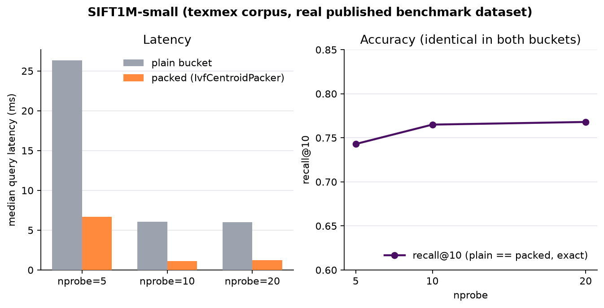
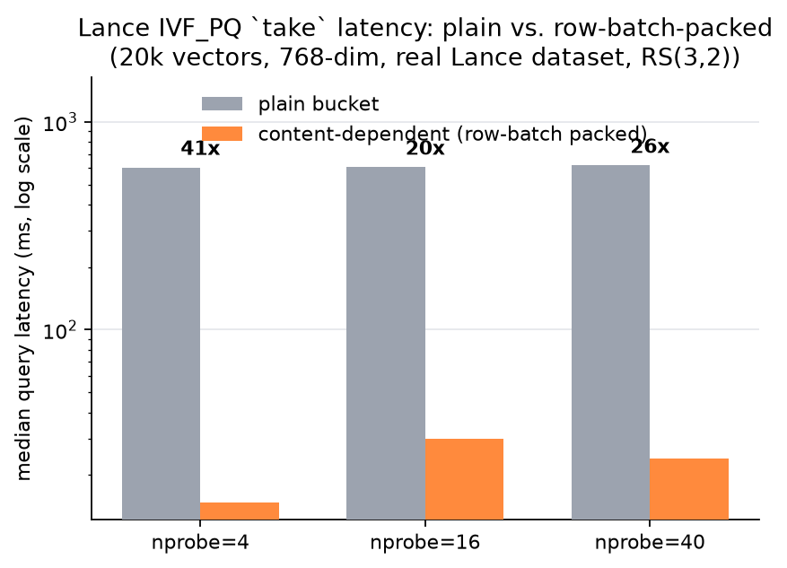
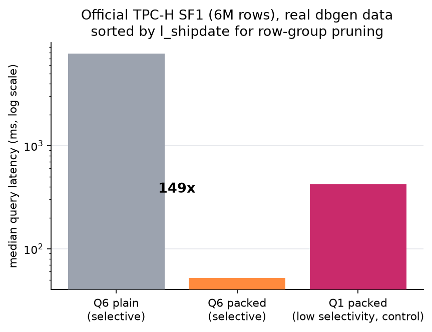

# WarpDrive v1.0.0 — Distributed Engine Results

These numbers were measured against a live WarpDrive cluster (symmetric
multi-node, gRPC fan-out, Reed-Solomon erasure coding) — not a simulator,
not a synthetic microbenchmark. Where an established workload tool exists,
we used it unmodified against its own data: Lance's vector-search engine
and index format, DuckDB's `tpch` extension (`dbgen` plus the official 22
TPC-H queries), and the texmex/SIFT1M-small corpus the ANN-search
community already benchmarks against. Methodology notes and caveats are
called out inline and summarized at the bottom.

See [`Technical-Architecture.md`](../Technical-Architecture.md) for how the
engine itself is built (`PlacementPolicy`, `StripePacker`, `ErasureCoder`,
`LocationStore`, the S3 shim).

## 1. Vector search: Lance IVF_PQ, content-dependent placement

[Lance](https://lancedb.github.io/lance/) is a widely used columnar format
and vector-search engine. We pointed its own `object_store::aws` client at
two WarpDrive buckets holding the same Lance dataset, same index, same
unmodified Lance query engine — one bucket stored plain (whole-object
erasure coding), the other configured to use `IvfCentroidPacker`, a
`StripePacker` that groups IVF partitions by k-means cluster id and
bin-packs within each cluster.

### 1a. SIFT1M-small, a published benchmark

Data: the `siftsmall` subset of the texmex SIFT1M corpus (10,000 base
vectors, 100 queries, 100 pre-computed ground-truth neighbors), the same
dataset LanceDB's own published benchmarks use. Ground truth was
independently re-verified with a brute-force exact search before being
trusted.

| nprobe | plain (ms) | packed (ms) | speedup | recall@10 (plain) | recall@10 (packed) |
|---:|---:|---:|---:|---:|---:|
| 5  | 26.35 | 6.68 | 3.9x | 0.743 | 0.743 |
| 10 | 6.08  | 1.10 | 5.5x | 0.765 | 0.765 |
| 20 | 5.99  | 1.24 | 4.8x | 0.768 | 0.768 |

Recall@10 is identical between plain and packed at every nprobe level.
Content-dependent placement changes where bytes live, not which bytes are
returned — checked against independently-verifiable ground truth, not
just agreement between our own two buckets.

### 1b. Larger dataset, row-batch packing

A 20,000-vector/768-dim dataset isolates where query latency actually
goes: once the IVF aux-file packing above was confirmed correct but not
the dominant cost, instrumentation showed the dominant cost is
reconstructing the ~60MB data fragment file to materialize 10 result
rows. Applying the same content-dependent mechanism to that file (20-row
batches, no cluster metadata needed — row access for a `take` is
uniform-random, so this reduces to size-based bin-packing) gives the
largest win measured so far:

| nprobe | plain (ms) | packed (ms) | speedup |
|---:|---:|---:|---:|
| 4  | 603.5 | 14.7 | 41x |
| 16 | 604.9 | 29.8 | 20x |
| 40 | 616.9 | 24.0 | 26x |

Verified correct across 5 independent trials: both returned row ids and
actual vector values matched exactly between the two buckets, not just
row counts.

## 2. Analytical SQL: official TPC-H via DuckDB, pushdown

[DuckDB](https://duckdb.org)'s `tpch` extension generates the official
TPC-H dataset (`CALL dbgen(sf=1)` → 6,001,215 `lineitem` rows) and exposes
the official 22 TPC-H queries (`tpch_queries()`) verbatim. Q1 and Q6 are
the only two that touch solely `lineitem` (every other query joins
multiple tables), matching our single-Parquet-file infrastructure without
needing cross-table joins.

The exported Parquet file was physically sorted by `l_shipdate` before
upload — a standard clustering technique (the same idea as Databricks'
Z-ORDER or an Iceberg/Delta sort order), not a change to the data or the
query results. It's what makes Q6's one-year date predicate actually
prunable via Parquet row-group min/max statistics; checked directly that
without this sort, every row group's min/max spans nearly the entire
7-year date range and nothing is prunable regardless of placement.

| Query | Selectivity | Bucket | Median latency | Notes |
|---|---|---|---:|---|
| Q6 | Selective (1-yr date window + discount/quantity range) | plain | 7756.6 ms | no stripe concept, full reconstruction per range-GET |
| Q6 | Selective | packed | 51.9 ms | 149x faster — 252 range-GETs, avg 1.0 of 268 stripes touched per request |
| Q1 | Low selectivity (~96% of rows match) | packed only | 419.7 ms | control: 1074 range-GETs, avg 2.2 of 268 stripes/request — less to prune, so less isolation per request |

Both buckets were verified byte-identical to the dbgen-generated file
before timing, and Q6's `revenue` result (`123141078.2283`) matched
between plain and packed. The plain-vs-packed contrast is the evidence for
pushdown: packed-bucket cost scales down with query selectivity (there's
a stripe boundary to skip past), plain-bucket cost stays flat regardless
of selectivity (no sub-object boundary to exploit at all).

## Methodology notes and caveats

- **Erasure-coding parameter**: all results on this page use the dev-loop
  default RS(3,2) (3 data + 2 parity shards), not Fusion's RS(9,6).
  Re-running at RS(9,6) is the natural next validation step and has not
  been done yet.
- **Single local cluster**: all measurements are from a local multi-process
  cluster on one machine (symmetric nodes, real gRPC calls between them,
  real disk I/O per node) — not yet a multi-VM/cross-datacenter run. See
  `docs/Distributed-Engine-Plan.md` for the separate GCP multi-VM baseline
  (unrelated to content-dependent placement, establishes the core engine's
  raw throughput).
- **No MinIO comparison yet** — deferred, tracked as follow-up work.
- **SIFT1M-small, not full SIFT1M** — the 10k-vector subset, not the full
  1M-vector corpus; a full-scale run is a natural next step.
- Every number above came from a script that also independently verifies
  correctness (byte-identical round-trip, recall@10 against ground truth,
  or exact result-value equality) in the same run that produced the
  timing — never timed without that check passing first.
